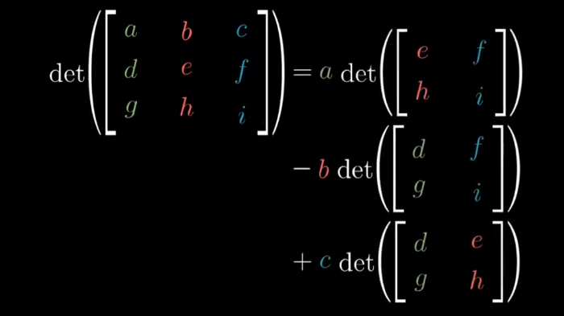

## **Video 6 : Determinant**

 - The Determinant of Matrix is the change in the area covered by the Vectors after the Transformation
   
 - Determinant is Zero 0 if the area squeeze down to Single
 - -ve Determinant is caused due to flipping of Orientation of Space
 - In 3D Matrix the Determinant is the Volume changedgit

    
    
