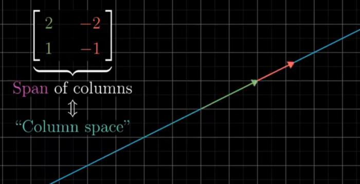

## **Video 7 : Inverse , Rank**

- It can be Visually Interpreted as the Transformation required so that the Vector A lands on vector V after the Transformation
- Inverse Transformation is the transformation required from V to go back to A (AInv A is Identity since it ends up doing nothing )
- Unless the the Determinant is Not ZERO the Determinant will Exist (if zero the area will be line and you cannot decompose back line back to area or volume through a single function)
- A Inverse X A is doing Nothing thus the Identity matrix
- Solution can Still exist if the Determinant is zero if the solution exist on the Same Line
- When the output of Determinant is 0 (it squeeze down to a line ) then the Rank of the Matrix is said to be 1 , if the Transformation lands on a 2-D Plane instead of a line than it has the Rank 2
- RANK : is the number of Dimensions in the Output
- Be it Line of Plane : it is called the Columns Space of a Matrix , and column tells where the base vector lands 
- Span of Columns = Column Space

- 0,0 is always in the Column Space since in the Linear Transformation the origin cannot be moved and any number of vectors can land on the origin after the Transformation thus it is the Null Space (Kernel of Matrix)of the Vector