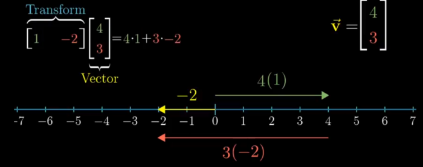

## **Video 9 : Dot Product and Duality**

- Dot Product is projecting a Vector onto other vector and Multiplying their Length , if the projection is in other direction the Dot Product will be Negative , and if Perpendicular then the projection will be zero

- Order dosen’t Matter who projects onto whom

- vector Multiplication (1X2 Matrice = 2D Matrice)

- Duality : Natural correspondence (ie linear transformation of vector is some other vector in that space ) (ie 2 computation that look similar )
