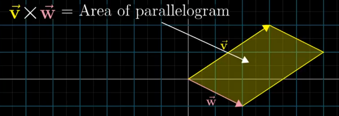
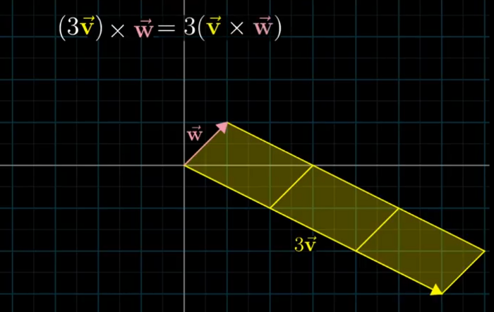

## **Video 10 : Cross Product**

- take a vector v and move the vector w to the end of it and then repeat the same in other order (ie take w and move start of v to end of w)the diagram obtained is a parallelogram ) — the Determinant
- +ve and -ve is due to the order (j should be on left of I anticlockwise )

- The Cross product is not a number its a resultant vector as per Right hand thumb rule of the magnitude given by the number

