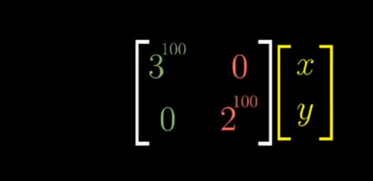
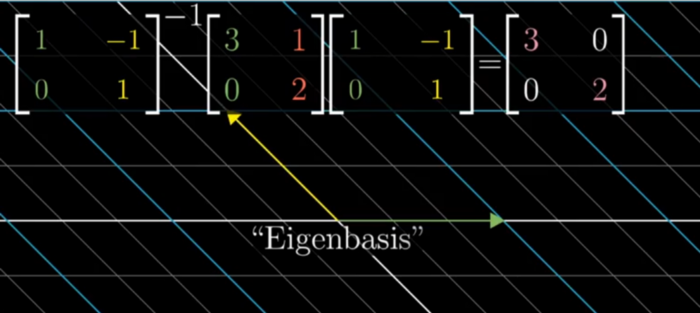

- when a vector is transformed the span of it also changes but sometimes even after transformation the span doesn't changes
- For those vectors which remain on their span even after transformation but stretched are called the eigen vectors of the transformation and eigen values are the factors by which they are stretched or squished

- We have to find the value of the lambda so that the determinant is zero so that the following assumption becomes true

Not all matrices have eigen basis