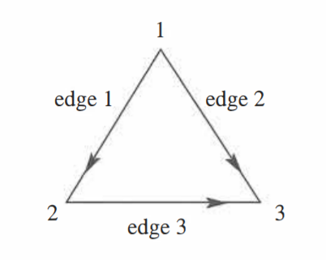
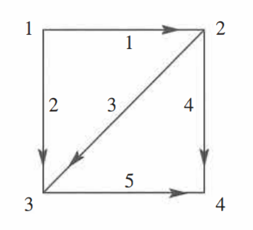

## Assignment for Lectures 10 to 12

Upload different documents for each question.

### Q.1) Orthogonality in Subspaces

Prove the orthogonality between:
1. row space and nullspace, AND
2. column space and left nullspace.

This answer should be handwritten and uploaded as a PDF file.

### Q.2) Code for Four Fundamental Subspaces

Write a code (in any language) to find the basis to the four fundamental subspaces of a matrix. Don't use linear algebra libraries.

Input Format:

```
<Number of rows> <Number of columns>
<Row-wise entry of elements of the matrix>
```

Output Format:

```
<Basis of Column Space>
<Basis of Nullspace>
<Basis of Row Space>
<Basis of Left Nullspace>
```

Upload the code file and a document containing screenshot(s) of the output.

### Q.3) Code to Find the Current and Potentials for a Graph

Write a code (in any language) to find the current along the edges and potentials at the nodes of a graph (electric circuit) using the incidence matrix, conductance along edges, and external current source (refer Section 10.1 of Introduction to Linear Algebra by Gilbert Strang Fifth Edition - Pg. 457). Don't use linear algebra libraries.

Input Format:

```
<Number of rows> <Number of columns>
<Row-wise entry of elements of the incidence matrix>
<Conductance for each edge>
<External current source>
```

Output Format:

```
<Current along edges>
<Potential at nodes>
```

Upload the code file and a document containing screenshot(s) of the output. Make assumptions wherever required but state them clearly in the document along with conventions used.

### Q.4) Problems on Graphs

1. Write down the 3 by 3 incidence matrix A for the triangle graph. The first row has -1 in column 1 and +1 in column 2. What vectors (x<sub>1</sub>, x<sub>2</sub>, x<sub>3</sub>) are in its nullspace? How do you know that (1, 0, 0) is not in its row space?



2. With conductances c<sub>1</sub> = c<sub>2</sub> = 2 and c<sub>3</sub> = c<sub>4</sub> = c<sub>5</sub> = 3, multiply the matrices A<sup>T</sup>CA. Find a solution to A<sup>T</sup>CAx = f = (1, 0, 0, -1). Write these potentials x and currents y = -CAx on the nodes and edges of the square graph.



3. Suppose A is a 11 by 8 incidence matrix formed from a connected unknown graph. How many columns of A are independent? What significance does A<sup>T</sup>A have? HINT: Check the diagonal entries. With this information, what is the sum of the diagonal entries of A<sup>T</sup>A of this specific 11 x 8 matrix?

4. If A = uv<sup>T</sup> is a 2 by 2 matrix of rank 1, what are the four fundamental subspaces of A? If another matrix B produces the same four subspaces, what is the relationship between A and B?

These answers should be handwritten and uploaded as a PDF file.
