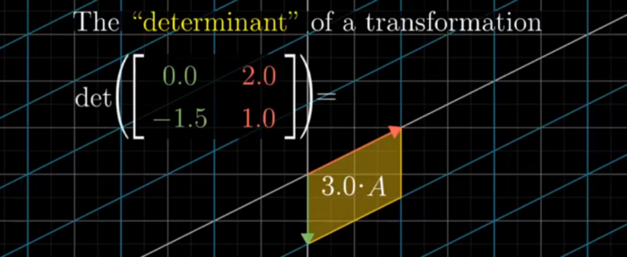
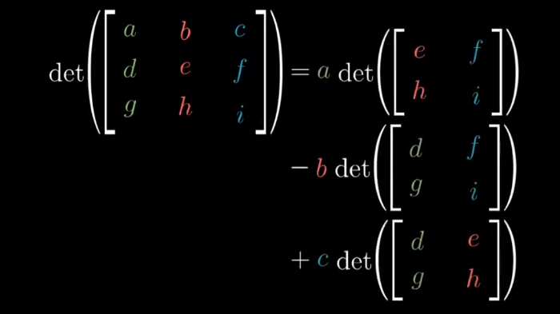
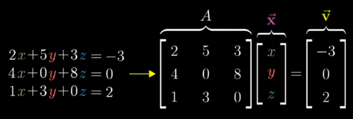
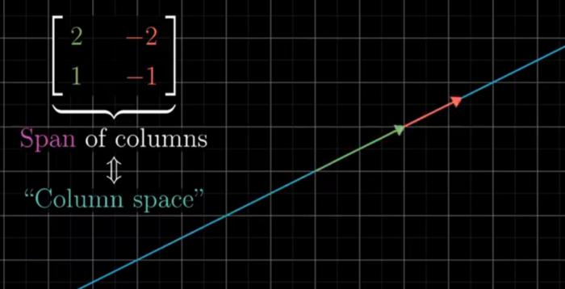

# Vectors, what even are they?

## Meaning of Vector
* Viewpoints of various domian of study. 
    * for Physicist (arrows pointing in space)
    * CS Student (ordered list of numbers, sets) 
    * Mathematician (Generalizes both the ideas together).

* In Linear Algebra the Vector will almost always origin at 0,0 in Space. And the root of it will always be fixed which is different compared to the way Physics students define vectors.

*  Vectors are coordinates as to how much distance along the X-axis or Y axis , that can also be represented in form of a 2X1 Matrix

## Addition
* the process of finding one vector that is equivalent to the result of the successive application of two or more given vectors. (OR in simple words) To add vectors, lay the first one on a set of axes with its tail at the origin. Place the next vector with its tail at the previous vector's head. When there are no more vectors, draw a straight line from the origin to the head of the last vector. This line is the sum of the vectors.

## Scaling
* Multiplication of a vector by a positive scalar changes the magnitude of the vector, but leaves its direction unchanged. The scalar changes the size of the vector. The scalar "scales" the vector.

# Linear combinations, span, and basis vectors

* i vector is unit vector along x-axix and j is unit vector along y-axis.

* i and j form the Basis of the Coordinate System (and everything else is just scaling these basis in the coordinate system).

* **Basis**: The Basis of a vector is a set of linearly independent vectors that span the full space.

* **Linear combination** is an expression constructed from a set of terms by multiplying each term by a constant and adding the results (e.g. a linear combination of x and y would be any expression of the form ax + by, where a and b are constants).

* The choice of basis vector matters when choosing a coordinate system.

* **Span** : Span of two vectors is set of all linear combinations (ie the points they can reach).

* If adding two vectors keeps the resultant vector span in the same dimension then they are Linearly dependent , and if their addition adds a new span of dimensions then they are “Linear independent”.

* Same concept of Basis and Span is followed in 3 dimensions as well. Where Linear combination of 3 vectors can span the entire 3-D space.

# Linear transformations and matrices

**Linear Transformation** :Linear (all lines must remain straight and Origin remains fixed )+ Transformation (a function that takes an input and gives an output, the transformation is used instead of function to bring int the role of moment of vector from its initial position to final position ) in easier words parallel and evenly spaced.

Now since we need to think about a lot of vectors and their transformation at a time, it is always better to visualize them as points in space.

* A2-D linear transformation depends on only 4 numbers.
    * 2 cordinates where the i lands.
    * 2 cordinates where the j lands.

These four numbers can be represented in the matrix form as follows:

Here each column represents the point where the i and j vector lands after transformation.

# Matrix multiplication as composition

* **Composition** is a way of chaining transformations together. The composition of matrix transformations corresponds to a notion of multiplying two matrices together

* Matrix Multiplication is Not Commutative

* Matrix Multiplication is Not Associative

# Three-dimensional linear transformations

All the concepts of 2-D matrix transformation are followed by the 3-D matrix transformation as well. The only difference being that earlier we were working with 4 numbers in a matrix whereas now we will work on 9 numbers in matrix 

Each of the 3 columns represents the landing position of i,j and k basis vectors respectively.

# **Determinant**

 - The Determinant of Matrix is the change in the area covered by the Vectors after the Transformation
   
 - Determinant is Zero 0 if the area squeeze down to lower dimension
 - -ve Determinant is caused due to flipping of Orientation of Space
 - In 3D Matrix the Determinant is the change in Volume

    
    

# **Inverse , Rank**

- It can be Visually Interpreted as the Transformation required so that the Vector A lands on vector V after the Transformation
- Inverse Transformation is the transformation required from V to go back to A
- Unless the the Determinant is Not ZERO the Inverse will Exist (if zero the area will be line and you cannot decompose back line back to area or volume through a single function)
- A Inverse X A is doing Nothing thus the Identity matrix
- Solution can Still exist if the Determinant is zero if the solution exist on the Same Line
- When the output of Determinant is 0 (it squeeze down to a line ) then the Rank of the Matrix is said to be 1 , if the Transformation lands on a 2-D Plane instead of a line than it has the Rank 2
- RANK : is the number of Dimensions in the Output
- Be it Line of Plane : it is called the Columns Space of a Matrix , and column tells where the base vector lands 
- Span of Columns = Column Space

- 0,0 is always in the Column Space since in the Linear Transformation the origin cannot be moved and any number of vectors can land on the origin after the Transformation thus it is the Null Space (Kernel of Matrix)of the Vector

# **Non Square Matrices and Transformation**
- Transformation can occur between inter Dimensions in 1D-2D etc

