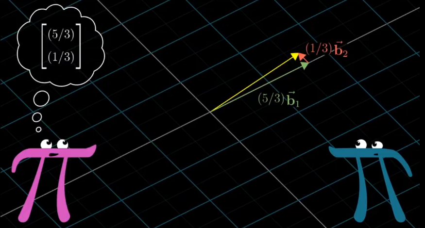

# **Dot Product and Duality**

- Dot Product is projecting a Vector onto other vector and Multiplying their Length , if the projection is in other direction the Dot Product will be Negative , and if Perpendicular then the projection will be zero

- Order dosen’t Matter who projects onto whom

- vector Multiplication (1X2 Matrice = 2D Matrice)

- Duality : Natural correspondence (ie linear transformation of vector is some other vector in that space ) (ie 2 computation that look similar )

# **Cross Product**

- take a vector v and move the vector w to the end of it and then repeat the same in other order (ie take w and move start of v to end of w)the diagram obtained is a parallelogram ) — the Determinant
- +ve and -ve is due to the order (j should be on left of I anticlockwise )

- The Cross product is not a number its a resultant vector as per Right hand thumb rule of the magnitude given by the number

# Cross products in the light of linear transformations 

The **Cross product** a × b is defined as a vector c that is perpendicular (orthogonal) to both a and b, with a direction given by the right-hand rule and a magnitude equal to the area of the parallelogram that the vectors span

The linear transformation to the number line can be matched to a vector which is called the dual vector of that transformation, such that performing the linear transformation is same as taking the dot product with that vector.

# Cramer's rule, explained geometrically

An orthogonal transformation is a linear transformation which preserves a symmetric inner product. In particular, an orthogonal transformation (technically, an orthonormal transformation) preserves lengths of vectors and angles between vectors.

# Change of Basis

In linear algebra, a basis for a vector space is a linearly independent set spanning the vector space.

Geometrically the matrix represents transformation from other grid to our grid, but numerically it is exactly opposite.

Inverse of Matrix represents the reverse linear transformation. So the Inverse matrix will be the transformation that will transform the vector from our grid to the other grids.

Translation matrices is not same as transforming vectors. The following pictures show the various steps in translating a matrix from one coordinate system to another.

- when a vector is transformed the span of it also changes but sometimes even after transformation the span doesn't changes
- For those vectors which remain on their span even after transformation but stretched are called the eigen vectors of the transformation and eigen values are the factors by which they are stretched or squished

- We have to find the value of the lambda so that the determinant is zero so that the following assumption becomes true

Not all matrices have eigen basis

