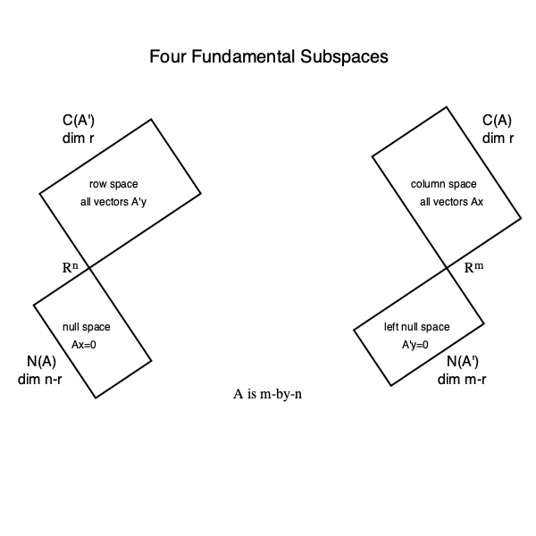

# 10 - Four fundamental subspaces

For a matrix `A`

|                                      |                                    |                                  |
| :----------------------------------: | :--------------------------------: | :------------------------------: |
|        **Column Space C(A)**         |    combination of columns of A     |  Rr in Rm  |
|         **Null Space N(A)**          |      all solution of `Ax = 0`      | Rn-r in Rn |
|    **Row Space C(AT)**    |      combination of rows of A      |  Rr in Rn  |
| **Left Null Space N(AT)** | all solution of ATy = 0 | Rm-r in Rm |

* Basis of `row` space of A ==> first `r` rows of R or A
* Basis of `column` space of A ==> pivot columns of `A`
* Basis of `null` space of A ==> special solution of A
* Basis of `left null` space of A ==> transforming `[A | I] ---> [R | E]`, look for combination of rows which give zero row
* When the rank is as large as possible, r = n or r = m or r = m = n, the matrix has a left-inverse B or a right-inverse C or a two-sided A-1
* Row spaces of A, U(echelon form) and R(reduced row echelon form) are same.
* Column spaces of A, U(echelon form) and R(reduced row echelon form) are different.

### 3x3 matrices a vector space?

  
View Answer

    
  >  _Yes. Since they contain a Null vector and follow all other rules of being a vector space._

  
### What are its subspaces?

  
View Answer

    
  >  _upper triangular, symmetrical, diagonal..._

