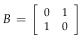
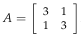
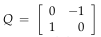
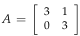

# Eigenvalues and Eigenvectors

A matrix A acts on vectors x like a function does, with input x and output Ax.

Eigenvectors are vectors for which Ax is parallel to x. In other words:

    Ax = λx.

In this equation, x is an eigenvector of A and λ is an eigenvalue of A.

If the eigenvalue λ equals 0 then Ax = 0x = 0. Vectors with eigenvalue 0 make
up the nullspace of A; if A is singular, then λ = 0 is an eigenvalue of A.

## det ( A − λI ) = 0

* In order to get a non-zero eigenvector, A − λI must be singular. In other words,
det ( A − λI ) = 0. We can solve this characteristic equation for λ to get n solutions.

* An (**n x n**) matrix will have **n** eigenvalues, and their sum will be the sum of the diagonal entries of the matrix: a11 + a22 + · · · + ann . This sum is the trace of the matrix. For a two by two matrix, if we know one eigenvalue we can use this fact to find the second.

* We might get n distinct eigenvalues or 1 or more repeated eigenvalues. 

* In general, the eigenvalues of a two by two matrix are the solutions to:

    λ2 − trace ( A ) · λ + det A = 0

* Once we’ve found an eigenvalue λ, we can use elimination to find the nullspace of A − λI. The vectors in that nullspace are eigenvectors of A with eigenvalue λ.

## Examples

* Suppose P is the matrix of a projection onto a plane. For any **x** in the plane
P**x** = **x**, so **x** is an eigenvector with eigenvalue 1. 

* A vector **x** perpendicular to the plane has P**x** = 0, so this is an eigenvector with eigenvalue λ = 0. The eigenvectors of P span the whole space (but this is not true for every matrix).

* Real eigenvalues

    

    

    
Eigenvalues

    1, -1
    

    

    
Eigenvectors

    [1,1] with λ = 1, [1,-1] with λ = -1
    

    

    

    
Eigenvalues

    4, 2
    

    

    
Eigenvectors

    [1,1] with λ = 1, [1,-1] with λ = -1
    

    **Note**: 
    * The eigenvectors of A are the same as those of B. Adding 3I to the matrix B added 3 to each of its eigenvalues and did not change its eigenvectors, because Ax = ( B + 3I ) x = λx + 3x = ( λ + 3 ) x.
    * The eigenvalues of the sum (A+B) and product AB aren’t usually equal to the sum λ ( A ) + λ ( b ) and product λ ( A ) λ ( b ) respectively.

* Complex eigenvalues

    

    

    
Eigenvalues

    i, -i
    

    **Note**:
    * If a matrix has a complex eigenvalue a + bi then the complex conjugate a − bi is also an eigenvalue of that matrix.
    * Symmetric matrices have real eigenvalues. For antisymmetric matrices like Q, for which AT = − A, all eigenvalues are imaginary (λ = bi).

* Triangular matrices and repeated eigenvalues

    

    

    
Eigenvalues

    3, 3
    

    

    
Eigenvectors

    [1,0]
    
