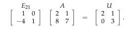

## Factorization into A = LU

    Goal of this lecture is to understand Gaussian elimination in terms of matrices. 
    To find a matrix L such that A = LU. 
    We start with some useful facts about matrix multiplication.

### Inverse of a product

* The inverse of a matrix product AB is B − 1A − 1 .

### Transpose of a product

We obtain the <i>transpose</i> of a matrix by exchanging its rows and columns. 

In other words, the entry in row <i>i</i> column <i>j</i> of A is the entry in row <i>j</i> column <i>i</i> of AT i.e. <b>Aij = (AT)ji</b>

* The transpose of a matrix product AB is BTAT. 

* For any invertible matrix A, the inverse of AT is (A− 1)T.

### A = LU

We’ve seen how to use elimination to convert a suitable matrix A into an upper triangular matrix U. This leads to the factorization A = LU, which is very helpful in understanding the matrix A.

Recall that (when there are no row exchanges) we can describe the elimination of the entries of matrix A in terms of multiplication by a succession of elimination matrices Eij , so that A &rarr; E21A &rarr; E31E21A &rarr; · · · &rarr; U. 

In the 2x2 case this looks like:

  

We can convert this to a factorization A = LU by “canceling” the matrix E21 ;
multiply by its inverse to get (E21)-1E21A = (E21-1)U

The matrix U is upper triangular with pivots on the diagonal. The matrix L is <i>lower triangular</i> and has ones on the diagonal. Sometimes we will also want to factor out a diagonal matrix whose entries are the pivots:

In the three dimensional case, if E32E31E21A = U then A = E21-1E31-1E32-1 U =
LU.

For example, suppose E31 is the identity matrix and E32 and E21 are as
shown below:

The 10 in the lower left corner arises because we subtracted twice the first row
from the second row, then subtracted five times the new second row from the
third.

The factorization A = LU is preferable to the statement EA = U because the combination of row subtractions does not have the effect on L that it did on E. Here L = E−1 = E21-1E32-1 :

Notice the 0 in row three column one of L = E−1 , where E had a 10. If there are no row exchanges, the multipliers from the elimination matrices are copied directly into L.

### How expensive is elimination?
Some applications require inverting very large matrices This is done using a computer, of course. How hard will the computer have to work? How long will it take?

When using elimination to find the factorization A = LU we just saw that we can build L as we go by keeping track of row subtractions. We have to remember L and (the matrix which will become) U; we don’t have to store A or E ij in the computer’s memory.

How many operations does the computer perform during the elimination process for an n × n matrix? A typical operation is to multiply one row and then subtract it from another, which requires on the order of n operations. There are n rows, so the total number of operations used in eliminating entries in the first column is about n2 . The second row and column are shorter; that product costs about ( n − 1 )2 operations, and so on. The total number of operations needed to factor A into LU is on the order of n3 :

While we’re factoring A we’re also operating on b. That costs about n2 operations, which is hardly worth counting compared to 1/3 ( n3 ) .

### Row exchanges

What if there are row exchanges? In other words, what happens if there’s a zero in a pivot position?

To swap two rows, we multiply on the left by a permutation matrix. For example,

swaps the first and second rows of a 3 × 3 matrix. The inverse of any permutation matrix P is P−1 = PT .

There are n! different ways to permute the rows of an n × n matrix (including the permutation that leaves all rows fixed) so there are n! permutation matrices. These matrices form a multiplicative group.