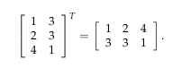

## Transposes, permutations, spaces Rn
In this lecture we introduce vector spaces and their subspaces.

## Permutations

Multiplication by a permutation matrix P swaps the rows of a matrix; when applying the method of elimination we use permutation matrices to move zeros out of pivot positions. Our factorization A = LU then becomes PA = LU, where P is a permutation matrix which reorders any number of rows of A. Recall that P−1 = PT , i.e. that PTP = I.

### Transposes
When we take the transpose of a matrix, its rows become columns and its columns become rows. If we denote the entry in row <i>i</i> column <i>j</i> of matrix A by Aij , then we can describe AT by: (AT)ij = Aji . For example:

A matrix A is <i>symmetric</i> if AT = A. Given any matrix R (not necessarily square) the product RTR is always symmetric, because (RTR)T = RT(RT)T = RTR. (Note that (RT)T = R.)

### Vector spaces

We can add vectors and multiply them by numbers, which means we can discuss <i>linear combinations</i> of vectors. These combinations follow the rules of a <i>vector space</i>.

One such vector space is R2 , the set of all vectors with exactly two real number components. We depict the vector [a b] by drawing an arrow from the origin to the point ( a, b ) which is a units to the right of the origin and b units above it, and we call R2 the “x − y plane”.

Another example of a space is Rn , the set of (column) vectors with n real number components.

### Closure

The collection of vectors with exactly two positive real valued components is not a vector space. The sum of any two vectors in that collection is again in the collection, but multiplying any vector by, say, − 5, gives a vector that’s not in the collection. We say that this collection of positive vectors is closed under addition but not under multiplication.

If a collection of vectors is <i>closed</i> under linear combinations (i.e. under addition and multiplication by any real numbers), and if multiplication and addition behave in a reasonable way, then we call that collection a <i>vector space</i>.

### Subspaces

A vector space that is contained inside of another vector space is called a <i>subspace</i> of that space. For example, take any non-zero vector v in R2 . Then the set of all vectors cv, where c is a real number, forms a subspace of R2 . This collection of vectors describes a line through [0 0] in R2 and is closed under addition.

A line in R2 that does not pass through the origin is not a subspace of R2 .
Multiplying any vector on that line by 0 gives the zero vector, which does not lie on the line. 

Every subspace must contain the zero vector because vector spaces are closed under multiplication.

The subspaces of R2 are:

1. all of R2 ,
2. any line through [0 0] and
3. the zero vector alone (Z).

The subspaces of R3 are:

1. all of R3 ,
2. any plane through the origin,
3. any line through the origin, and
4. the zero vector alone (Z). 

### Column Space

Given a matrix A with columns in R3 , these columns and all their linear combinations form a subspace of R3. This is the *column space* C(A). 