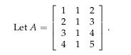

## Column space and nullspace

In this lecture we continue to study subspaces, particularly the column space and nullspace of a matrix.

### Review of subspaces

A vector space is a collection of vectors which is closed under linear combinations. In other words, for any two vectors v and w in the space and any two real numbers c and d, the vector cv + dw is also in the vector space. A subspace is a vector space contained inside a vector space.

A plane P containing [0 0 0] and a line L containing [0 0 0] are both subspaces of R3 The union P U L of those two subspaces is generally not a subspace, because the sum of a vector in P and a vector in L is probably not contained in P U L. The intersection S ∩ T of two subspaces S and T is a subspace. To prove this, use the fact that both S and T are closed under linear combinations to show that their intersection is closed under linear combinations.

### Column space of A

The *column space* of a matrix A is the vector space made up of all linear combinations of the columns of A.

#### Solving Ax = b

Given a matrix A, for what vectors **b** does **Ax = b** have a solution **x**?

Then Ax = b does not have a solution for every choice of b because solving Ax = b is equivalent to solving four linear equations in three unknowns. If there is a solution x to Ax = b, then b must be a linear combination of the columns of A. Only three columns cannot fill the entire four dimensional vector space – some vectors b cannot be expressed as linear combinations of columns of A.

**Question** : What b’s allow Ax = b to be solved?

A useful approach is to choose x and find the vector b = Ax corresponding to that solution. The components of x are just the coefficients in a linear combination of columns of A.

The system of linear equations Ax = b is *solvable* exactly when b is a vector in the *column space* of A.

**Question**: For our example matrix A, what can we say about the column space of A? Are the columns of A independent? In other words, does each column contribute something new to the subspace? 

The third column of A is the sum of the first two columns, so does not add anything to the subspace. The column space of our matrix A is a two dimensional subspace of R4 .

### Nullspace of A

The nullspace of a matrix A is the collection of all solutions x = [x1 x2 x3] to the equation Ax = 0. 

The column space of the matrix in our example was a subspace of R4. The nullspace of A is a subspace of R3. To see that it’s a vector space, check that any sum or multiple of solutions to Ax = 0 is also a solution: A ( x1 + x2 ) =
Ax1 + Ax2 = 0 + 0 and A ( cx ) = cAx = c ( 0 ) .

In the example:

the nullspace N ( A ) consists of all multiples of [1 1 -1]; column 1 plus column 2 minus column 3 equals the zero vector. This nullspace is a line in R3.

#### Other values of b

The solutions to the equation:

do not form a subspace. The zero vector is not a solution to this equation. The set of solutions forms a line in R3 that passes through the points [1 0 0] and [0 -1 1] but not [0 0 0].

