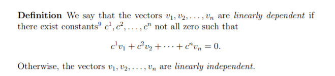

##  Linear Independence, Basis and Dimension
  
- **Linear independence:** A set of vectors {v1, v2, · · · , vn} is linearly independent when no linear combination
of them (except for the 0 combination) result in a 0 vector.

Example: 

- A set of vectors is linearly dependent if some vector can be expressed as a linear combination of the others (i.e., is in the **span** of the other vectors). (Such a vector is said to be redundant.)

## Span

- **Question**: Is zero vector linearly Independent or dependent?

Answer

Zero vector is a multiple of any vector, so it is collinear with any other vector. Hence it is Linearly dependent.

### Spanning, Basis, and Dimensions

- **Spanning Definition:** A set of vectors {v1, v2, · · · , vl} span a space if the space consists of all linear combinations of
those vectors.

- **Basis Definition:** Let V be a vector space. If S is a basis of V and S has only finitely many elements, then we say that V is finite-dimensional.

- The number of vectors in S(i.e. basis) is the dimension of V. 

### Basis
- A basis for vector space V is a set of vectors that
  - Is Linearly Independent
  - Spans V.
  - **Example:** The set {x^2,x,1} is a basis for the vector space of polynomials in x with real coefficients having degree at most 2.
  - **Question:** What are the possible basis for R^2×2.

Answer

There are many possible answers. One possible answer is:  

### Dimension
- The number of vectors in a basis for V is called the dimension of V, denoted by **dim(V)**.
- Every set of linearly independent vectors in V has size at most dim(V). For example, a set of four vectors in R^3(3D Space) cannot be a linearly independent set.

Here are some facts:
- A set of vectors in R^n {v1, · · · , vn} gives a basis if the n × n matrix with those as columns gives an invertible matrix.
- Every basis has the same number of vectors, the number being the dimension of the space.
