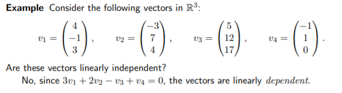

##  Linear Independence, Basis and Dimension
  
**Linear independence:** A set of vectors {v1, v2, · · · , vn} is linearly independent when no linear combination
of them (except for the 0 combination) result in a 0 vector.

Example: 

  
### Spanning, Basis, and Dimensions

- **Spanning Definition:** A set of vectors {v1, v2, · · · , vl} span a space if the space consists of all linear combinations of
those vectors.

- **Basis Definition:** Let V be a vector space. Then a set S is a basis for V if S is linearly independent and V = span S. If S is a basis of V and S has only finitely many elements, then we say
that V is finite-dimensional.

- The number of vectors in S is the dimension of V . 

### Basis

A Basis for a vector space is a sequence of vectors with two properties:
- The basis vectors are linearly independent.
- The basis vectos span the space.

### Dimension
- The dimension of vector space is the number of vectors in every basis.

Here are some facts:
- A set of vectors in R^n {v1, · · · , vn} gives a basis if the n × n matrix with those as columns gives an invertible matrix.
- Every basis has the same number of vectors, the number being the dimension of the space.
