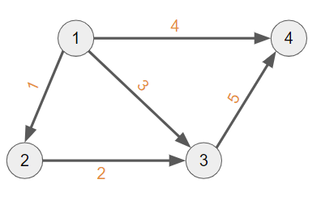
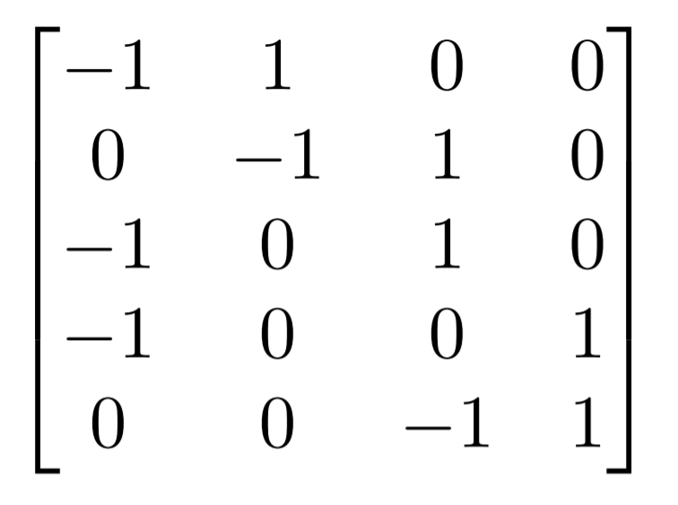
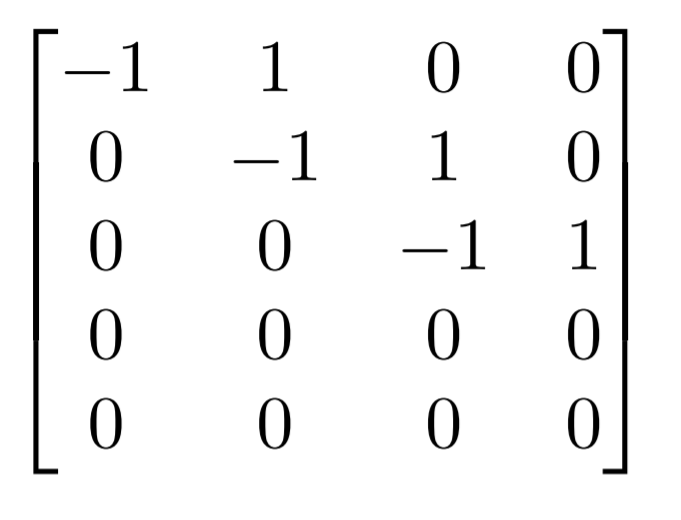
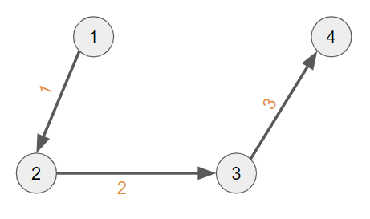
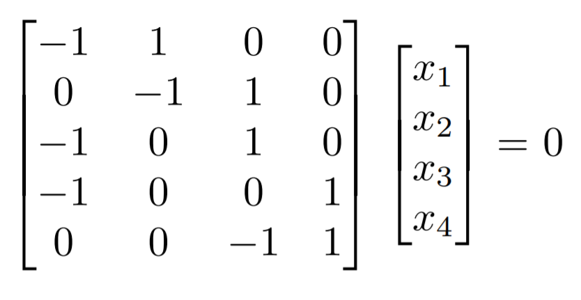
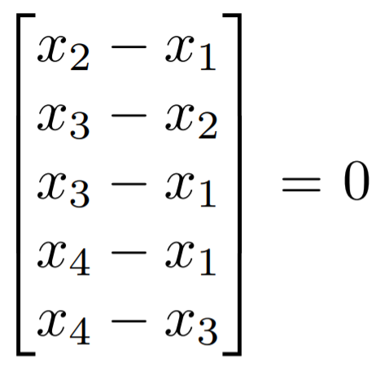
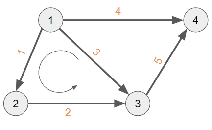
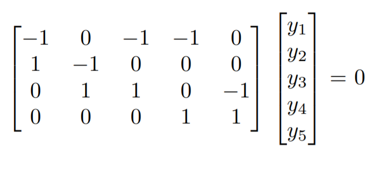
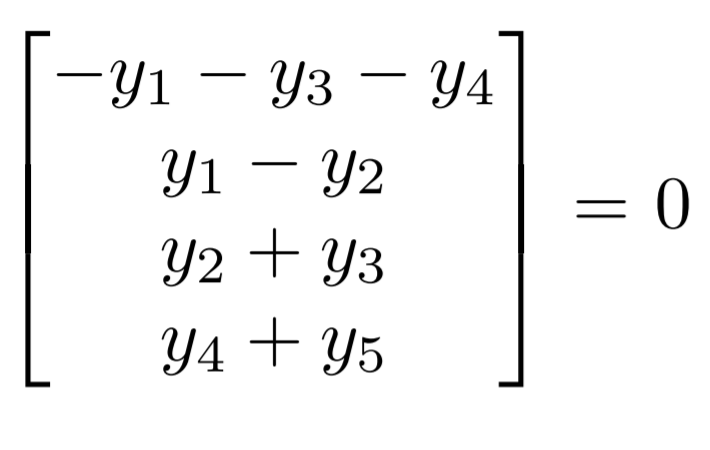
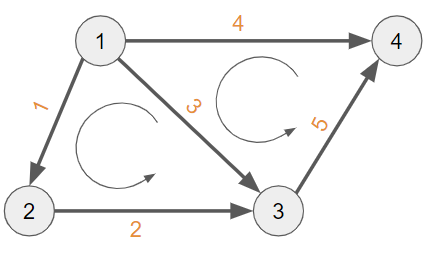

## Graphs, Networks, Incidence Matrices

This session explores the linear algebra of electrical networks and sheds light on important results in graph theory.

Consider this directed graph - 

Here `m` = 5 edges, `n` = 4 nodes.

### Incidence Matrix

`A` - Incidence matrix used to denote this graph.

It is the 5 by 4 matrix which tells us which nodes are connected by which edges.

In general, an incidence matrix is a logical matrix that shows the relationship between two classes of objects, usually called an incidence relation. Here, we are showing the relationship between the edges and nodes of the graph.

Row numbers in A are edge numbers, column numbers are node numbers.

* -1 means the edge is going out of the node.

* 1 means the edge is going into the node.

* 0 means the edge does not connect this node.

### Analysing the Incidence Matrix

#### <u>Elimination</u>

After elimination, we get -

This represents the following <b>tree</b>.

Elimination reduces every graph to a tree (the graph has no closed loops). Rows are dependent when edges form a loop. Independent rows come from trees.

This also gives us the rank, `r` = 3.

#### <u>The Nullspace</u>

Let the nullspace solution of `A` be `x`.

`x` is basically the potential at each node.

`Ax = 0`

`Ax` denotes the Potential Difference between nodes.

It is 0 when all the potentials are the same.

So nullspace includes all vectors of the form
`c(1, 1, 1, 1)`

So the <b>dimension of nullspace = `n - r` = 1</b>

Current doesn't flow when potential difference is 0.

We can raise or lower all voltages by the same amount `c`, without changing the differences. There is an "arbitrary constant" in the voltages. 

The nullspace disappears when we fix x4 = 0. The unknown x4 is removed and so is the fourth column of A (the column multiplied x4). Basically, node 4 has been "grounded." So only zero vector is in the nullspace now.

#### <u>The Row Space</u>

The row space contains all combinations of the 3 row basis vectors since the matrix has a rank of 3.

<b>Dimension of rowspace = `r` = 3</b>

We got this from elimination.

How do we know if a vector is in the rowspace?

If it is perpendicular to (1, 1, 1, 1) in the nullspace. (Orthogonality)

#### <u>The Column Space</u>

The column space contains all combinations of the four columns. We expect three independent columns, since there were three independent rows. The first three columns of A are independent (so are any three).

So, <b>dimension of column space = `r` = 3</b>

How can we tell if a particular vector b is in the column space of an incidence matrix?

The components of b should add to 0 around every loop. Why?

`Ax` gives the vector of potential differences.

`Ax = b`

If we add differences around a closed loop in the graph, they cancel to leave zero.

For example, let's take the potential differences for this loop.

Here, `(x``2`` - x``1``) + (x``3`` - x``2``) - (x``3`` - x``1``) = 0`

These correspond to the components of b:

Therefore, `b``1`` + b``2`` - b``3`` = 0`

So a quick way to check if a vector is in the column space is to check whether the components add up to 0 around a loop (considering directions).

#### <u>The Left Nullspace</u>

The left nullspace contains the solutions to `A``T``y = 0`.

<b>Dimension of left nullspace = `m - r` = 2</b>

Here, `y` is the current along each edge.

Thus, the net flow at each node should be zero.

We can find the basis by assuming current (`y`) through one edge and solving such that there is no charge accumulation.

What are solutions to `A``T``y = 0`?

Currents which balance themselves. Every loop current is a solution.

Here, we have 2 small independent loops. The big loop of 1-2-3-4-1 is basically the sum of these two loops.

Flows around the 2 small loops are a basis for the left nullspace.

Thus, (1, 1, -1, 0, 0) and (0, 0, 1, -1, 1) form the basis.

Number of independent loops = dimension of left nullspace.

### Kirchhoff's Voltage Law

Kirchhoff's Voltage Law states that for a closed loop series path the algebraic sum of all the voltages around any closed loop in a circuit is equal to zero.

This can be found from the column space.

In terms of vectors, the law states that the components of Ax = b add to zero around every loop.

### Kirchhoff's Current Law

Kirchhoff's Current Law states that the current flowing into a node (or a junction) must be equal to the current flowing out of it.

This can be found from the left nullspace.

In terms of vectors, the law states that `A``T``y = 0`. Flow in equals flow out at each node.

### Euler's Formula

The incidence matrix A comes from a connected graph with n nodes and m edges. The row space and column space have dimensions `r = n - 1`. The nullspaces of A and AT have dimensions `1` and `m - n + 1`:

* <b>N(A) -</b> The constant vectors `(c, c, ... , c)` make up the nullspace of `A` : `dim = n - r = 1`.
* <b>C(AT) -</b> The edges of any tree give `r` independent rows of `A` : `r = n - 1`.
* <b>C(A) -</b> Voltage Law - The components of `Ax` add to zero around all loops : `dim = n - 1`.
* <b>N(AT) -</b> Current Law - `A``T``y = (flow in) - (flow out) = 0` is solved by loop currents : `dim = m - r`

There are `m - r = m - n + 1` independent small loops in the graph.

For every graph in a plane, linear algebra yields Euler's formula:

<b>`(number of nodes) - (number of edges) + (number of small loops) = 1`

This is `n - m + (m - n + 1) = 1`</b>

How?

`n - m + (m - n + 1)`

`= n - m + m - r`

`= n - r`

`= 1`

### Ohm's Law

* If resistances are 1, Ohm's Law will match `y = -Ax`. Then `A``T``y = -A``T``Ax = 0`.

* Minus sign is there in circuit theory - we change from `Ax` to `-Ax`. This is because the flow is from higher potential to lower potential. There is (positive) current from node 1 to node 2 when `x``1`` - x``2` is positive, whereas `Ax` was constructed to yield `x``2`` - x``1`.

* Without any sources, the solution to `A``T``Ax = 0` will just be no flow: `x = 0 and y = 0`.

* So for current to flow, we either need to fix voltages to one or more nodes, or add voltage or current sources.

* For example, on adding a current source,
`A``T``Ax = f`

* Here, `f` represents the source added.

* This is because Kirchhoff's Current Law changes from `A``T``y = 0` to `A``T``y = -f`, to balance the source `f` from outside.

* The `A``T``A` is the <b>graph Laplacian matrix</b>. It is always symmetric.

* But this doesn't consider the whole picture because the resistances are 1 here.

* Let `R` be a matrix of resistance values.

* Now, Ohm's Law takes the form of : `Ry = -Ax`

* Let `C` be a matrix of conductance values. `C` is called the <b>Conductance Matrix</b>. It is a diagonal `m` by `m` matrix.

* `C = R``-1`

* Now, Ohm's Law takes the form of : <b>`y = -CAx`</b>

* Ohm's Law states that current along an edge = conductance times the voltage difference.

* Ohm's Law for all m currents is `y = -CAx`. The vector `Ax` gives the potential differences, and `C` multiplies by the conductances.

* Combining Ohm's Law with Kirchhoff's Current Law (`A``T``y = 0` or `A``T``y = -f` for a current source `f`), we get `A``T``CAx = 0` or `A``T``CAx = f`.

* Finally, we get <b>`A``T``CAx = f`</b>.
