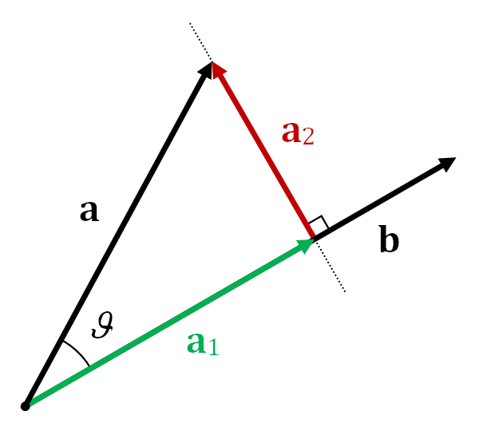
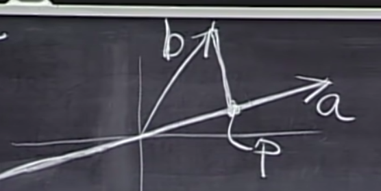

# 15 - Projections into subspaces

### The basics of projection

### Defining a basic formula for projecting b onto a line formed by a single vector.

- Let `p` be the projection of `b` onto the line going through `a`.
- Since `p` is at the shortest distance possible from `b`, the line joining them must be perpendicular to the line formed by multiples of `a`.
- Therefore, if `e = b - p`, then e must be perpendicular to a.
- Now `p` is a scalar multiple of `a`, so let `p = ax` with x being a scalar.
- We get aT (b- ax) = 0.
- Rearranging and substituting x, p = a(aT  . b / aT  . a)
- By using the associative law, we see that p = (a . aT / aT  . a)b with the first bracket being known as the projection matrix.

### Applying this formula to approximating Ax = b when there are no solutions to it.

- Instead of solving `Ax=b` we solve `Ax=p`, where `p` is the projection of `b` onto the coloumn space of A.
- So we first find `p` and then predict `x` as the closest answer.
- So in this case `b - p` i.e. `b - Ax` has to be perpendicular to the plane with basis vectors as `a1` and `a2` (this is an example of a 2-dimensional subspace)
- So, a1T (b - Ax) = 0 and a2T (b - Ax) = 0, combining which vertically gives, AT (b - Ax) = 0.
- Rearranging and substituting, we get AT Ax = AT b, p= A (AT A)^-1 AT b

### Some important properties of P (the projecting matrix)'
- PT = P
- P . P  = P
