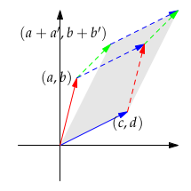

# Applications of Determinants
We know a formula for and some properties of the determinant. Now we see
how the determinant can be used.
## Formula for A-1

<b>A-1 = CT/det(A)</b>

To verify the formula, we’ll check that ACT = (det A) I.

The entry in the first row and first column of the product matrix is:

(This is just the cofactor formula for the determinant.) This happens for every
entry on the diagonal of ACT .

To finish proving that ACT = (det A) I, we just need to check that the off-
diagonal entries of ACT are zero. In the two by two case, multiplying the en­
tries in row 1 of A by the entries
in column
2 of CT gives a (− b ) + b ( a ) = 0.

This is the determinant of As:

In higher dimensions, the product of the first row of A and the last column of CT equals the determinant of a matrix
whose first and last rows are identical. This happens with all the off diagonal
matrices, which confirms that A−1 = CT/(detA)

## Cramer’s Rule for x = A−1b
We know that if Ax = b and A is nonsingular, then x = A−1b. Applying the formula A−1 = CT/(detA) gives us:

**x = CTb/(detA)**

Cramer’s rule gives us another way of looking at this equation. To derive
this rule we break x down into its components. Because the i’th component of CT b is a sum of cofactors times some number, it is the determinant of some matrix Bj.

**xj = det(Bj)/det(A)**

where Bj is the matrix created by starting with A and then replacing column j with b, so:

## The Volume of a Box

**Claim**: |det A| is the volume of the box (parallelepiped) whose edges are the
column vectors of A. (We could equally well use the row vectors, forming a
different box with the same volume.)

If A = I, then the box is a unit cube and its volume is 1. Because this agrees
with our claim, we can conclude that the volume obeys determinant **property
1**.

If A = Q is an orthogonal matrix then the box is a unit cube in a different
orientation with volume 1 = |det Q| . (Because Q is an orthogonal matrix,
QTQ = I and so det Q = ± 1.)

Swapping two columns of A does not change the volume of the box or (re­membering that det A = det AT) the absolute value of the determinant (**prop­erty 2**). If we show that the volume of the box also obeys property 3 we’ll have proven |det A| equals the volume of the box.

If we double the length of one column of A, we double the volume of the box formed by its columns. Volume satisfies **property 3(a)**.

**Property 3(b)** says that the determinant is linear in the rows of the matrix:

Following figure illustrates why this should be true.

