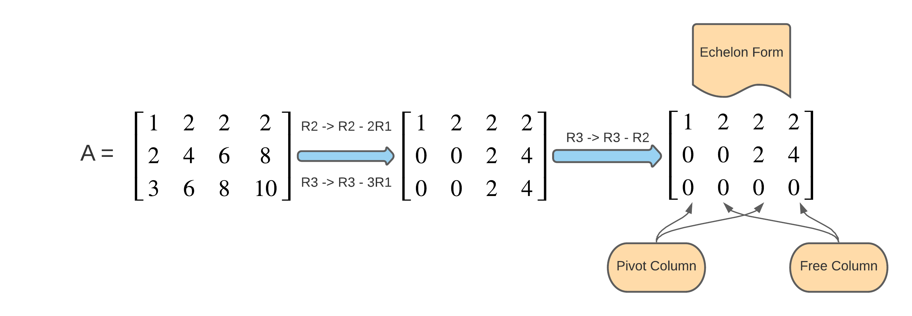
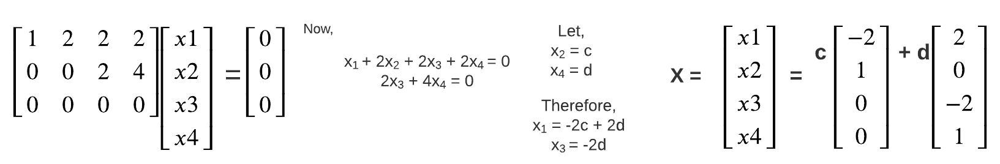
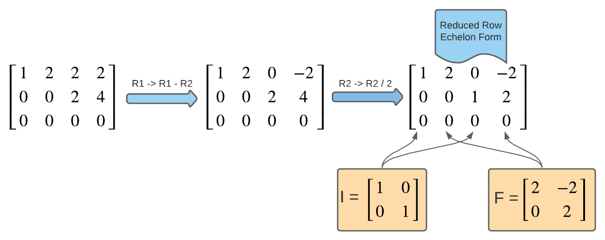
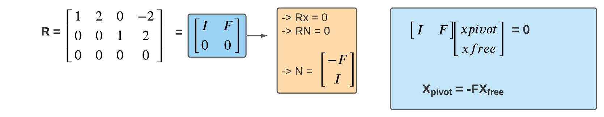
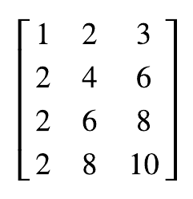
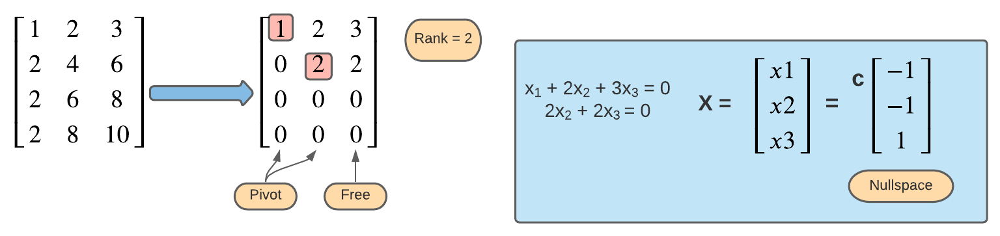
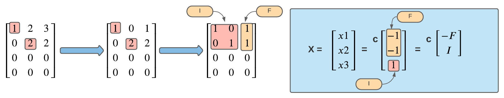

## Computing Ax=0, Pivot variables, special solutions.

* `pivot` = first non zero element in every row after elimination
* `pivot columns` = columns containing pivot 
* `pivot variables` = variables corresponding to pivot columns
* `free columns` = columns without pivot
* `free variables` = variables corresponding to free columns
* `rank` = number of pivot variables

## Computing Ax = 0 using echelon form.

Consider the Martix A in the below diagram, using elementary row transformation converting the matrix in echelon form.

Now finding the solution x by putting free variables as random constants

## Reduced Row Echelon Form

If the leading coefficient in each row is the only non-zero number and unity in that column, the matrix is said to be in reduced row echelon form(rref). Consider the below example.

Here the martix I is the pivot columns and F is the free columns.

## Special Solution

Consider the matrix I and F from the above example. We can rewrite R in form given below.

Nullspace matrix have columns are special solution, their free variables have this special value `I` and pivot variable have `-F`

## Example

Consider the following matrix A.  

Find the nullspace of the given matrix

Answer

* Echelon form

* Reduced form

<blockquote>
</blockquote>

