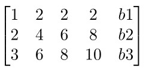
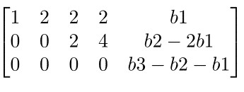
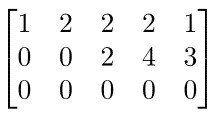
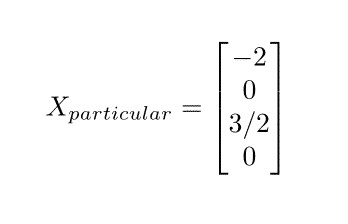
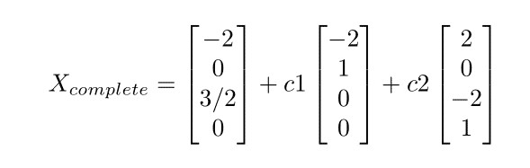

## Complete Solution for Ax=b, Reduced Row Echlon Form R

### Solving Ax=b
The equations are: 
  x1 + 2x2 + 2x3 + 2x4 = b1 
 2x1 + 4x2 + 6x3 + 8x4 = b2 
 3x1 + 6x2 + 8x3 + 10x4 =b3  
The augmented matrix would be: 

 After performing row operations on the matrix, you get the reduced form as: 

 Considering b as 1,5,6 we get the matrix as: 

 

### Solvability
Determining whether Ax=b is solvable or no. 
Ax=b is solvable when b is in the column space of A C(A).
If a combination of rows of A gives zero row then same combination of entries of b must give 0. 
In this case, the matrix is solvable and so lets find the solution. 

### Complete Solution for Ax=b
In order to find the complete solution for Ax=b, we need to find the particular solution. 
Xparticular : In order to find Xparticular, we need to set the free variables to 0 and then solve for the pivot variables. 
In our example we set x2=0 and x4=0, 
we get, 
x1 + 2x3 =1 
2x3 = 3 

 
Xnull space : In order to find Xnull space, we need to set the free varialbes as 0 and 1. 
Xcomplete = Xparticular + Xnull space   

 

### Rank of a matrix
Rank of a matrix is determined by :
* Number of pivot
* Number of independent columns/rows
* Dimension of column space   
r <= `max`(m, n) where,
 m = rows, n = columns   

|   Condition    |   Solution    |                    Comment                    |
| :------------: | :-----------: | :-------------------------------------------: |
|   r = n < m    |    0 or 1     | No free variables. Hence, null space is empty |
|   r = m < n    |   Infinite    |   Every row has pivot, `n-r` free variables   |
|   r = m = n    |    Unique     |               Invertible matrix               |
| r < m && r < n | 0 or Infinite |                depends on `b`                 |

                                                                                                                   

