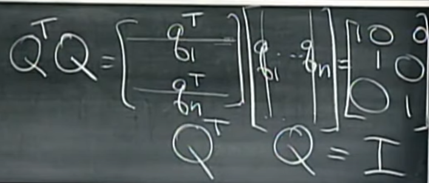
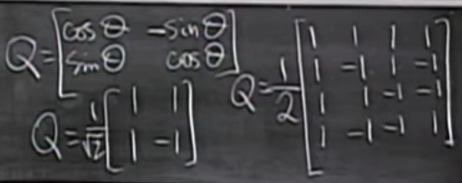
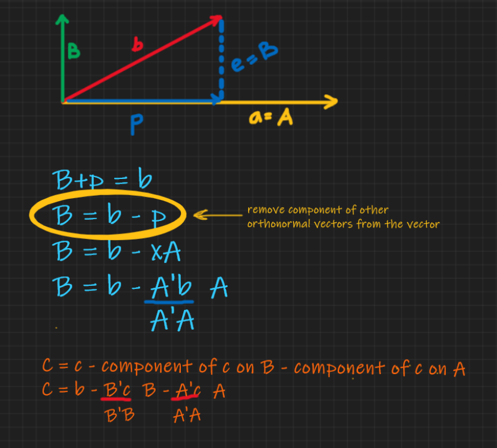

# 17 - Orthogonal basis, Orthogonal square matrix (Q), Gram-Schmidt (A --> Q)

* Orthonormal vector - 
  * qiTqj = 0, if i is not equal to j
  * qiTqj = 1, if i is equal to j

  That is they all have (normal) length 1 and are perpendicular (ortho) to each other. 

* QTQ = I {Qmxn: for all values of m,n }  
  
* BTW, QQT != I , for every Qmxn 

* QQT = I {Qmxn: m = n} (i.e. a square matrix)

* since QT is both left and right inverse, QT is complete inverse of Q, when Q is a square matrix
* if Q is square - QT = Q-1
> Example:
> <b>A Permutation matrix P</b>  
>    \[[0,1,0],  
>     [0,0,1],  
>     [1,0,0]]  
> This is an orthogonal matrix of dim 3x3. Square, hence, orthogonal matrix.  
> .........\[[0,0,1], 
> P-1 = [1,0,0], 
> .........[0,1,0]]  
> <b>P-1 = PT</b>

* Significance of square orthonormal matrix -
    * A square orthonormal matrix Q is called an <b> orthogonal matrix </b>.
    * Qmxm i.e. dimension of vector(m) of column vectors = number of basis vectors(n) of column space
    * square orthonormal matrix Q is composed of all basis vectors of the vector space
    * all columns are independent, hence, full rank -> inverse exists. 

* Why orthonormal Matrix ? What is made easier?
    * never overflow / underflow 
        * Overflow - extremely large exponents - higher powers towards infi e.g. 1010000
        * Underflow - extremely smaller values - lower powers towards 0 e.g. 10- 10000 
        * how ? 

  * Projection matrix calculation: P = Q(QTQ)-1QT = QQT
  * P = I if Q is square ( QT = Q-1)
    * intuitive significance? 
    Q is basis matrix of entire vector space. So asking for projection of a vector in its entire vector space is the same vector itself. 💁‍♀️
  * Many equations become trivial when using matrix with orthonormal columns. If our basis is orthonormal, the projection component xiˆ is just qi Tb because ATAxˆ = ATb becomes xˆ = QTb.
    * example
* Examples
  
    * Rotation matrices
    * Hadamard matrices: Combinations of \[[1,1],[1,-1]]

* Orthonormal vectors are always independent. Easy to prove. Try it. 
> 

>  
Hint 1

>    AX = O
> 
 
> 

>  
Hint 2

>    S.T. if QX = O then X = O
> 
 
> 

>  
Proof

> QX = O  
> QTQX = O   
> IX = O   
> X = O 
> 
 
* Gram-Schmidt (make matrix A to Q)  
  
  * take independent vectors of A - a, b
  * Make them orthogonal by projection
  * Normalize for orthonormal
  * For multiple vectors - one by one take vector and remove components of previous vectors from it
  * A = QR : Q is Orthonormal matrix, R is upper triangular 

