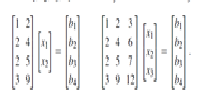
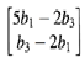
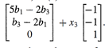

# Lec 8- Solving Ax = b: Row Reduced Form R

1.Find the value of c that makes it possible to solve Ax = b, and solve it:  
        u + v + 2w = 2  
       2u + 3v - w = 5  
       3u + 4v + w = c:  
       
 

Answer

c == 7 allows u = 1, v == 1, w == O. The column space is a plane.

2.What conditions on b1, b2, b3, b4 make each system solvable? Solve for x:

Answer

Solvable if b2 = 2b1 and 3b1 - ,3b3 + b4 = O. Then X = 
 

 
(b) Solvable if b2 == 2b1 and 3b1 - 3b3 + b4 == O. Then x =
 

