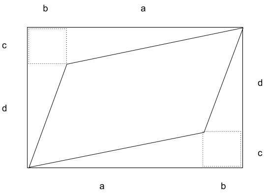

# Practice Problems

### 1. Which of the following is true for any matrix A?  
**_NOTE_: dim(C(A)) ==> dimension of column space of A, dim(N(A)) ==> dimension of null space of A**  
* rank(A) > dim(C(A))
* dim(C(A)) = dim(N(A))
* dim(N(A)) + dim(C(A)) = dimension of whole vector space
* None

  
View Answer

    
  >  _dim(N(A)) + dim(C(A)) = dimension of whole vector space_

### 2. Let A, B, C, D be n × n matrices. If ABCD = 1, then B-1?
* D-1C-1A-1
* CDA
* ADC
* None
* Insufficient information

  
View Answer

    
  >  _Insufficient information. Since it is not given that the matrices are invertible. If invertible the answer would be ==> CDA_

### 3. Find a transformation matrix in 3D space, that first rotates the space about X axis by 270o, then rotates the resulting space about its Y axis by 90o and finally rotates the resulting space about its Z axis by 180o (All rotations in clockwise direction)

  
View Answer

    
  Let A ==> Rotation about X by -270o  
      B ==> Rotation about Y by -90o  
      C ==> Rotation about Z by -180o since clockwise*  
  A = 
  
  |   1   |   0   |   0   |
  | :---: | :---: | :---: |
  |   0   |   0   |   1   |
  |   0   |  -1   |   0   |

  B = 
  
  |   0   |   0   |  -1   |
  | :---: | :---: | :---: |
  |   0   |   1   |   0   |
  |   1   |   0   |   0   |

  C = 
  
  |  -1   |   0   |   0   |
  | :---: | :---: | :---: |
  |   0   |   1   |   0   |
  |   0   |   0   |   1   |

  Resultant transformation = **C x B x A**  
  Think why preorder multiplication?

### 4. Does all natural numbers in range (0, ∞) form a vector space or sub space? Justify

  
View Answer

    
  >  _No, Since zero vector is not present_

### 5. Does all natural numbers in range (-∞, 0] form a vector space or sub space? Justify

  
View Answer

    
  >  _For any space to be a vector space/subspace, there should be closure i.e resultant vector after 
  linear transformation should lie in same space. But here the resultant can be positive and hence
  the answer is NO_

### 6. Does all 2D matrices form a vector space? Justify

  
View Answer

    
  >  _Yes_

### 7. A transformation matrix squishes 4D space into line, what is the rank of that matrix?
* 0
* 1
* 2
* 3
* 4

  
View Answer

    
  >  _1 (Since line)_

### 8. How many basis exists for a 4D vector space and how many vectors are there in that basis

  
View Answer

    
  >  _Infinite number of basis, each basis consists of 4 vectors_

### 9. Prove that determinant of the matrix given below is , det(A) = ad - bc

|     |     |
| --- | --- |
| a   | b   |
| c   | d   |

  
View Answer

    
    
  Area of resultant parallelogram = (a+b)x(c+d) - [2bc + ac/2 + ac/2 + bd/2 + bd/2]

